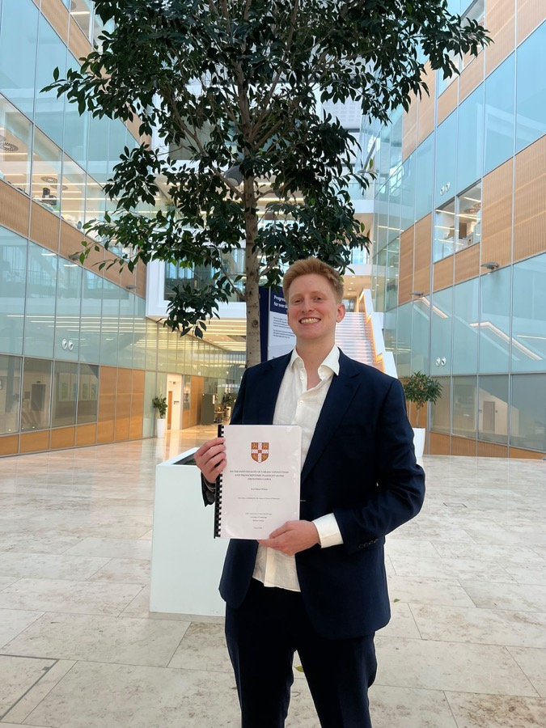

{.headshot fig-alt="Scott Wilson"}

I am a computational biologist, who has worked across various high dimensional
datasets to extract signal from noise. I recently completed my PhD in neuroscience
at the University of Cambridge. Eager to pursue a career which leads to macro-level,
positive outcomes across a changing world.

Before Cambridge I read Genetics at UCL and spent a research year at the Francis
Crick Institute. I'm part of the Santa Fe Institute working group on representation
in minds and artificial systems.

[Email](mailto:sc0ttwils0n@pm.me) · [GitHub](https://github.com/sc0ttwils0n)
<!-- Add when you have them: · [Google Scholar](URL) · [ORCID](URL) · [Bluesky](URL) -->
